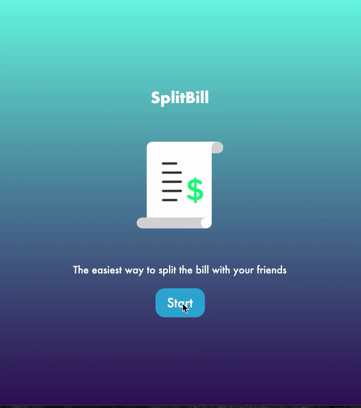

# Demo

## About

This was an app that I created out of an idea of a tool that I could use when I got out to eat with friends. Often we struggle with how to split the bill and wanted to create an app to solve that issue. 

While there were plenty of apps out there that already did this, I wanted to try to make one myself with features that I didn't see on other apps. Primarily, I wanted to create one that dealt specifically with the precision of the total bill. For example, some apps would only allow users to have whole percentages (5%, 15%, 20%) as tip. There was no 5.15% or anything that allowed the user to make the bill a whole number. Personally, I want to make my bill be a whole number.

## Approach

So the first iteration of this app was purely front-end focused. I used React.js to build this because I knew that I would be dealing with reusable components and state-management for the inputs.

In allowing the users to enter the subtotal (bill without tip), users are able to pick tip percentages. However, users can also enter custom numbers as well. One feature that I thought was helpful was when users entered the tip or total, the app would automatically adjust the tip or total. For example, if the subtotal was $24.64 and I put a custom total of $35.00, the tip will automatically be changed to the difference ($10.36).

In addition, the user can determine how many people are present / participating and the app will tell them how much each person will pay if they decide to split everything evenly.

Should people decide they want to pay for their own items, the user can modify the bill by clicking the button at the end of the page to go to the next page. Redux transfers those previous inputs into the next page and users are able to change how much they want to pay.